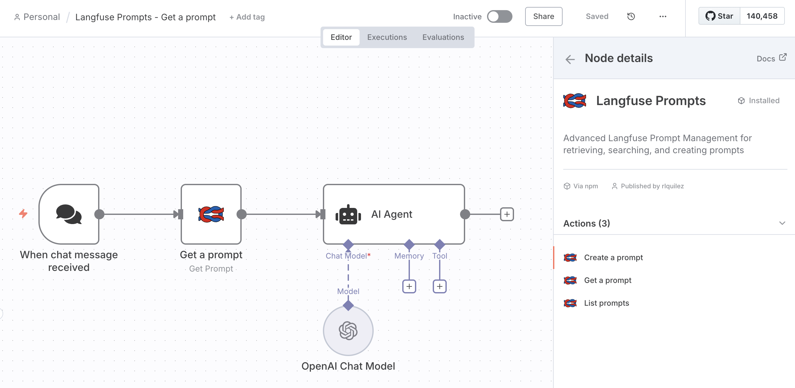
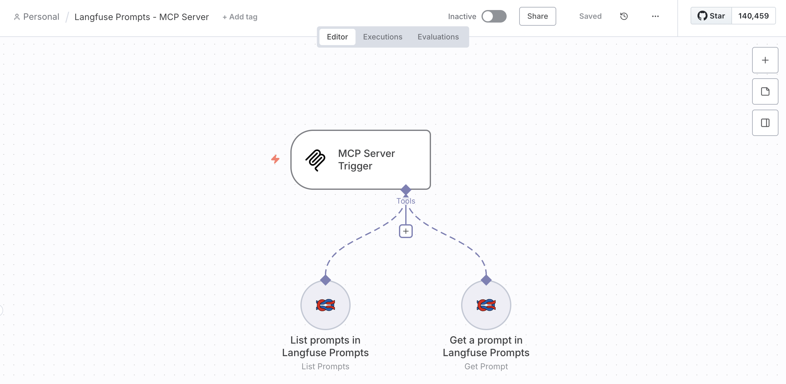

# n8n-nodes-langfuse

Enhanced Langfuse integration for n8n with advanced Prompt Management capabilities.

[](https://www.npmjs.com/package/@langfuse/n8n-nodes-langfuse)
[](https://opensource.org/licenses/MIT)
[](https://docs.n8n.io/integrations/community-nodes/)

[Langfuse](https://langfuse.com) is an open-source LLM engineering platform that provides observability, metrics, evaluations, prompt management and a playground.

[n8n](https://n8n.io/) is a [fair-code licensed](https://docs.n8n.io/reference/license/) workflow automation platform.

## Table of Contents

- [Features](#features)
- [Installation](#installation)
- [MCP Server Integration](#mcp-server-integration)
- [Credentials Setup](#credentials-setup)
- [Operations](#operations)
- [Docker Setup](#docker-setup)
- [Development](#development)
- [Troubleshooting](#troubleshooting)
- [Resources](#resources)
- [License](#license)

## Features

### Comprehensive Prompt Management
- **Get Prompt**: Retrieve specific prompts by name, version, or label
- **List Prompts**: Browse and search all prompts with advanced filtering
- **Create Prompt**: Create new text or chat prompts directly from n8n workflows

### Advanced Search Capabilities
- **Filter by Name**: Exact match filtering by prompt name
- **Smart Filtering**: Filter by tags, labels, and versions
- **Pagination Support**: Handle large prompt collections efficiently

### Modern Integration Features
- **MCP Server Compatible**: Works as a tool in Model Context Protocol workflows
- **Version Control**: Retrieve specific prompt versions and create new versions
- **Bulk Operations**: Process multiple prompts efficiently
- **Type Support**: Handle both text and chat-style prompts



## Installation

### Self-hosted n8n

Follow the [installation guide](https://docs.n8n.io/integrations/community-nodes/installation/) in the n8n community nodes documentation.

```bash
npm install @langfuse/n8n-nodes-langfuse
```

### n8n Cloud

This is a verified community node. Search for `Langfuse` to use this node in n8n Cloud.

### Method 3: Docker

Add to your docker-compose.yml:

```yaml
environment:
  N8N_NODES_INCLUDE: "@langfuse/n8n-nodes-langfuse"
```

## MCP Server Integration

This node supports **Model Context Protocol (MCP)**, enabling AI agents to interact directly with Langfuse prompts in n8n workflows.



### MCP Features
- **Tool Integration**: AI agents can use this node as a tool
- **Dynamic Access**: Agents can retrieve, search, and create prompts
- **Workflow Automation**: Seamless integration with n8n's MCP Server Trigger

### MCP Usage Example

```javascript
// AI agent can call:
{
  "operation": "get",
  "promptName": "customer-support-prompt",
  "label": "production"
}

// Or filter prompts:
{
  "operation": "list",
  "nameFilter": "customer-support",
  "labelFilter": "production"
}
```

## Credentials Setup

To use this node, you need to authenticate with Langfuse. You'll need:

1. A Langfuse account, either [Langfuse Cloud](https://cloud.langfuse.com) or [self-hosted](https://langfuse.com/self-hosting).
2. API credentials from your Langfuse project settings:
   - **Base URL**: Your Langfuse instance (e.g., https://cloud.langfuse.com)
   - **Public Key**: Your Langfuse public key  
   - **Secret Key**: Your Langfuse secret key

Find your API keys in Langfuse project settings.

## Operations

### Get Prompt

Retrieve a specific prompt by name from [Langfuse Prompt Management](https://langfuse.com/docs/prompts).

**Required Parameters:**
- promptName: The prompt name

**Optional Parameters:**
- label: Version label (e.g., "production")
- version: Specific version number

**Example:**
```json
{
  "operation": "get",
  "promptName": "customer-service-template",
  "label": "production"
}
```

### List Prompts

Browse and filter your prompts using Langfuse API v2 parameters.

**Optional Parameters:**
- nameFilter: Filter by exact prompt name match
- tagFilter: Filter by specific tag
- labelFilter: Filter by specific label
- versionFilter: Filter by version number
- page: Page number for pagination  
- limit: Items per page (1-100, default 50)

**Example:**
```json
{
  "operation": "list", 
  "tagFilter": "customer-support",
  "labelFilter": "production",
  "limit": 10
}
```

### Create Prompt

Create new text or chat prompts directly in Langfuse.

**Required Parameters:**
- createPromptName: Unique prompt name
- promptType: "text" or "chat"
- promptContent: Content for text prompts
- chatMessages: JSON array for chat prompts

**Optional Parameters:**
- labels: Comma-separated labels
- tags: Comma-separated tags
- config: JSON configuration object
- commitMessage: Version commit message

**Example - Text Prompt:**
```json
{
  "operation": "create",
  "createPromptName": "greeting-template",
  "promptType": "text",
  "promptContent": "Hello {{name}}, welcome to our service!",
  "labels": "production",
  "tags": "greeting,customer"
}
```

**Example - Chat Prompt:**
```json
{
  "operation": "create",
  "createPromptName": "support-agent-v2",
  "promptType": "chat",
  "chatMessages": [
    {
      "role": "system", 
      "content": "You are a helpful customer support agent..."
    },
    {
      "role": "user",
      "content": "{{customer_question}}"
    }
  ],
  "labels": "production,support",
  "tags": "customer-service,chat"
}
```

## Docker Setup

### Option 1: Environment Variable

```dockerfile
FROM n8nio/n8n:latest
ENV N8N_NODES_INCLUDE=@langfuse/n8n-nodes-langfuse
```

### Option 2: Docker Compose

```yaml
version: '3.8'
services:
  n8n:
    image: n8nio/n8n:latest
    environment:
      - N8N_NODES_INCLUDE=@langfuse/n8n-nodes-langfuse
    ports:
      - "5678:5678"
    volumes:
      - n8n_data:/home/node/.n8n
volumes:
  n8n_data:
```

### Option 3: Custom Build

```dockerfile
FROM n8nio/n8n:latest
USER root
RUN npm install -g @langfuse/n8n-nodes-langfuse
USER node
ENV N8N_NODES_INCLUDE=@langfuse/n8n-nodes-langfuse
```

## Development

### Prerequisites

You need the following installed on your development machine:

- [git](https://git-scm.com/downloads)
- Node.js and npm. Minimum version Node 20. You can find instructions on how to install both using nvm (Node Version Manager) for Linux, Mac, and WSL [here](https://github.com/nvm-sh/nvm). For Windows users, refer to Microsoft's guide to [Install NodeJS on Windows](https://docs.microsoft.com/en-us/windows/dev-environment/javascript/nodejs-on-windows).
- Install n8n with:
  ```
  npm install n8n -g
  ```
- Recommended: follow n8n's guide to [set up your development environment](https://docs.n8n.io/integrations/creating-nodes/build/node-development-environment/).

### Build new version

```bash
npm run build
npm link
```

### Test in local n8n

```bash
cd ~/.n8n/custom
npm link @langfuse/n8n-nodes-langfuse
```

## Troubleshooting

### Common Issues

**Node not appearing?**
- Restart n8n completely
- Check n8n version compatibility (requires n8n v0.187+)
- Verify package installation

**Filtering not working?**
- Ensure filter parameters are correctly formatted
- Check that values match exactly (especially for name filter)  
- Verify Langfuse instance version compatibility

**API connection issues?**
- Verify Langfuse credentials in n8n
- Check instance URL accessibility
- Ensure API keys have proper permissions
- Test the connection using the credential test feature

**MCP Server not recognizing the node?**
- Ensure `usableAsTool: true` is set in the node description
- Restart n8n after installation
- Check that the node is properly registered

### Getting Help
- Check [GitHub Issues](https://github.com/langfuse/n8n-nodes-langfuse/issues)
- Review [Langfuse API docs](https://langfuse.com/docs/api)
- Join [n8n Community](https://community.n8n.io/)

## Resources

- [n8n community nodes documentation](https://docs.n8n.io/integrations/#community-nodes)
- [Langfuse documentation](https://langfuse.com/docs)
- [Langfuse Prompt Management](https://langfuse.com/docs/prompts)
- [Model Context Protocol (MCP)](https://modelcontextprotocol.io/)

## License

[MIT](https://github.com/langfuse/n8n-nodes-langfuse/blob/master/LICENSE.md)
